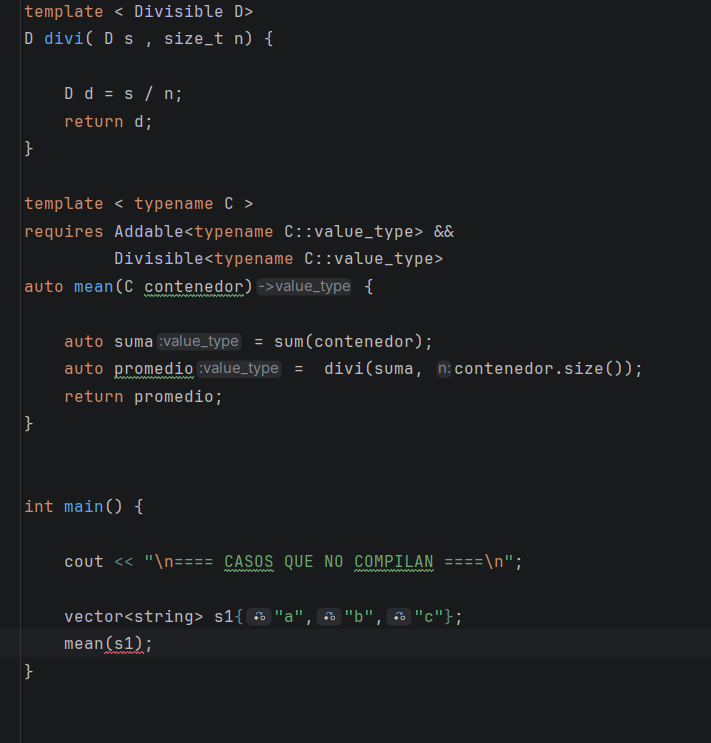
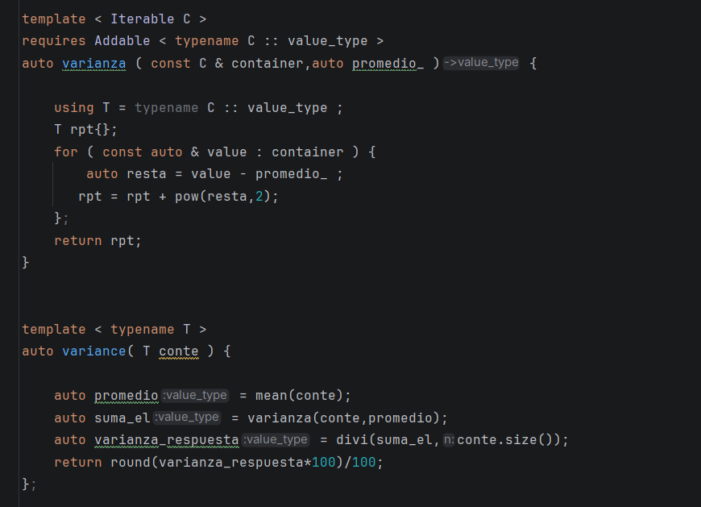

# TAREA---PROGRA-III---2

## 1. Conceptos Obligatorios y Personalizados:

### Aca vemos la implementacion de los conceptos ya dados por el enunciado, y uno más para poder usarlo en una pregunta. El ultimo concept se usará en la pregunta 4

## 2. Algortimo mean (tenemos que reutilizar la función sum y requerir divisible)

### Primero Reutilizamos la función sum, y lo usamos para hallar la suma total de todos los datos del contenedor. la función sum, recibe el contenedor para poder iterarlo y sumar sus valores.

### Luego usamos una función divi, que recibirá la suma y el tamaño del vector, siempre requerrimos que se pueda dividir los numeros, es decir que el tamaño del vector no sea cero. Y nos devuelve la divisón, lo que sería el promedio.

### Para terminar solo creamos la función mean, donde recibimos el contenedor, llamaos a sum y adivi y nos devuelve el promedio.No olvidar requerrir tanto a Addable y Divisible.

### Estos son casos de prueba que funionan.
### En el archivo test_2.cpp encontramos los datos que no compilarian.

#### aqui vemos el ejemplo de un error de compilación...

## 3. Algoritmo Variance (reutilizar mean , y restringido por addable y iterable)

### Lo primero, Creamos una función varianza, que es similar a sum, solo que  ahora vamos a recibir el contenedor y el promedio, para que cada valor del contendor se reste con el promedio, y luego lo acumulamos o sumamos para poder caular el primer paso de la varianza.

### Ya en la función variance, calculamos el promedio del contenedor recibido, y luego lo mandamos a varianza para calcular la suma de las potencias cuadradas de la resta con el promedio. Finalmente reutilizo el divi, osea la división entre el tamaño del vector, para calculart la varianza final.