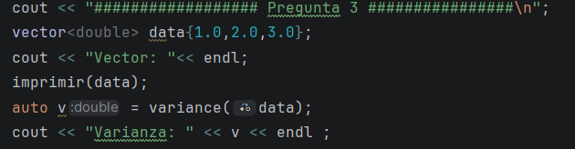
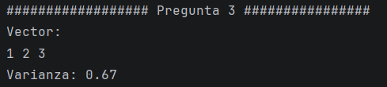
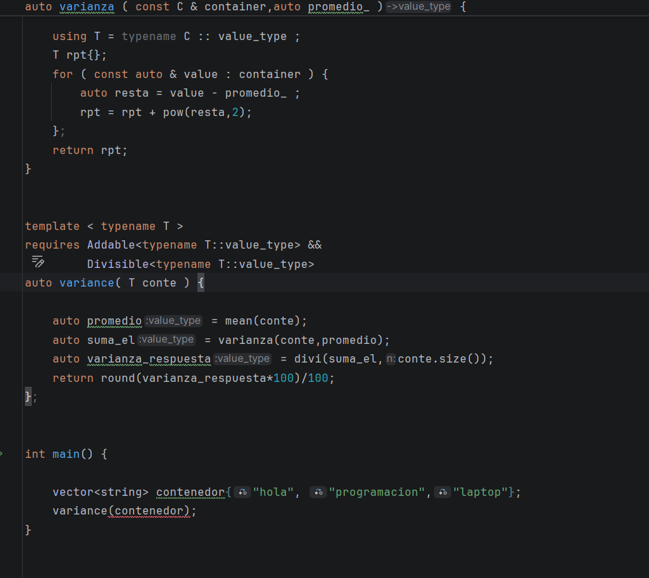
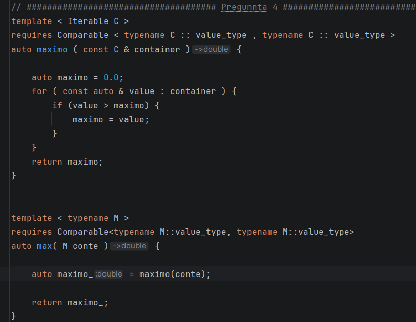
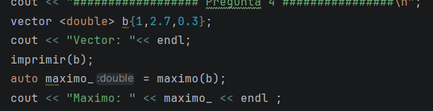
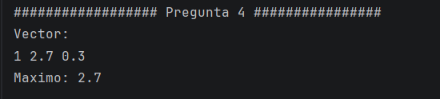
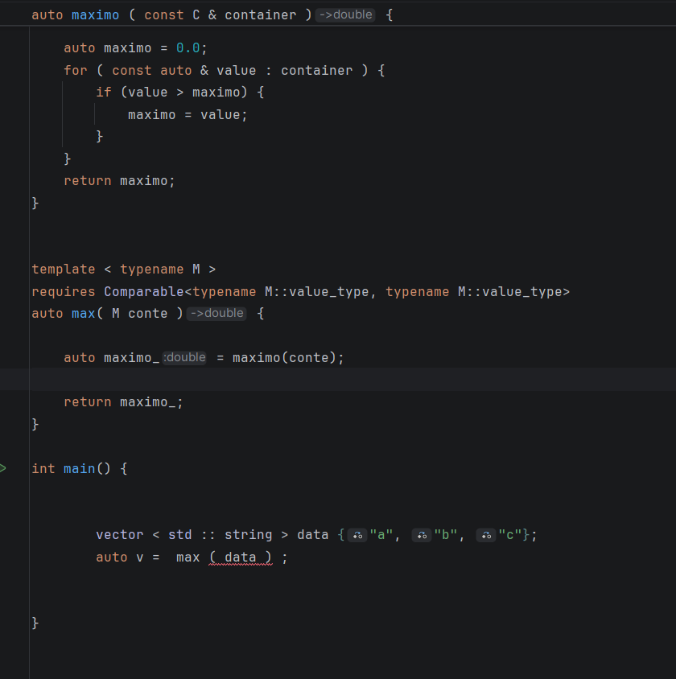

# TAREA---PROGRA-III---2

## 1. Conceptos Obligatorios y Personalizados:

### Aca vemos la implementacion de los conceptos ya dados por el enunciado, y uno más para poder usarlo en una pregunta. El ultimo concept se usará en la pregunta 4

## 2. Algortimo mean (tenemos que reutilizar la función sum y requerir divisible)

### Primero Reutilizamos la función sum, y lo usamos para hallar la suma total de todos los datos del contenedor. la función sum, recibe el contenedor para poder iterarlo y sumar sus valores.

### Luego usamos una función divi, que recibirá la suma y el tamaño del vector, siempre requerrimos que se pueda dividir los numeros, es decir que el tamaño del vector no sea cero. Y nos devuelve la divisón, lo que sería el promedio.

### Para terminar solo creamos la función mean, donde recibimos el contenedor, llamaos a sum y a divi y nos devuelve el promedio. No olvidar requerrir tanto a Addable y Divisible.

### Estos son casos de prueba que funcionan.
### En el archivo test_2.cpp encontramos los datos que no compilarian.

#### aqui vemos el ejemplo de un error de compilación...

## 3. Algoritmo Variance (reutilizar mean , y restringido por addable y iterable)

### Lo primero, Creamos una función varianza, que es similar a sum, solo que  ahora vamos a recibir el contenedor y el promedio, para que cada valor del contendor se reste con el promedio, y luego lo acumulamos o sumamos para poder calcular el primer paso de la varianza.

### Ya en la función variance, calculamos el promedio del contenedor recibido, y luego lo mandamos a varianza para calcular la suma de las potencias cuadradas de la resta con el promedio. Finalmente reutilizo el divi, osea la división entre el tamaño del vector, para calculart la varianza final. Por ver mejor el resultado lo redondeamos a dos decimales.

### Prueba en caso que si funcionan...

### Casos en lo que no funcionan.}

## 4. Max (Hallar el maximo valor del contenedor)

###  Para esta pregunta recordamos que tenemos un nuevo concept, que su rerstricción, es la comparación de dos valores, sí o sí tienen que ser o double o int, no puede ser strings ni char, considerando que char también se puede, pero no lo estamos considerando. 

### Luego creamos la función maximo. Lo que hace es recorrer todo el contenedor, antes incializando el cero, un numero para empezar a comparar, y si el numero es mayor, se reemplaza la variable maximo, por el mayor. Luego solo en la clase max se llama y se retorna loque ya se obtuvo. Cabe recalcar que en ambos, el requires es el nuevo concepto que creamos arriba. Tanto en amximo como en max.

### Estos son los casos de prueba para los que max funciona.

### Ahora en test_4.cpp, se puede econtrar los casos en que no compila, por que le mandamos un vector de string.

## 5. transform_reduce

## 6. Variadic Templates y fold expresions

## 7. if constexpr