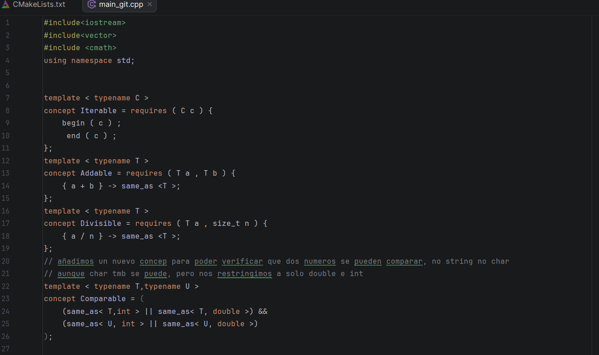
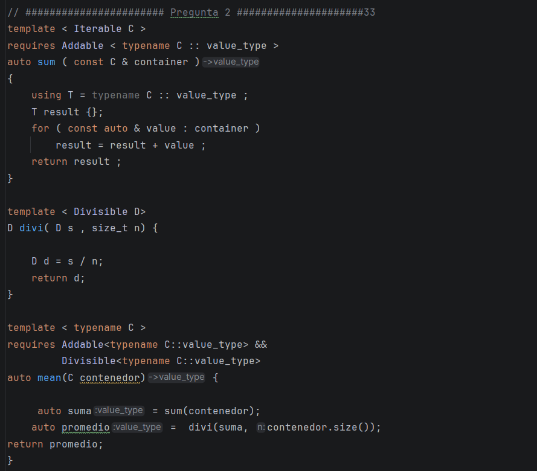
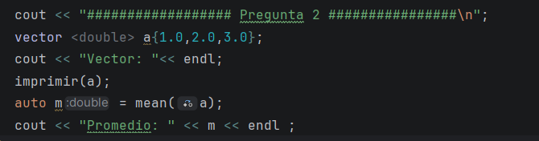
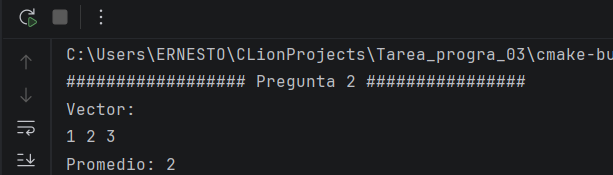

# TAREA---PROGRA-III---2

## 1. Conceptos Obligatorios y Personalizados:

### Aca vemos la implementacion de los conceptos ya dados por el enunciado, y uno más para poder usarlo en una pregunta. El ultimo concept se usará en la pregunta 4

## 2. Algortimo mean (tenemos que reutilizar la función sum y requerir divisible)

### Primero Reutilizamos la función sum, y lo usamos para hallar la suma total de todos los datos del contenedor. la función sum, recibe el contenedor para poder iterarlo y sumar sus valores.

### Luego usamos una función divi, que recibirá la suma y el tamaño del vector, siempre requerrimos que se pueda dividir los numeros, es decir que el tamaño del vector no sea cero. Y nos devuelve la divisón, lo que sería el promedio.

### Para terminar solo creamos la función mean, donde recibimos el contenedor, llamaos a sum y adivi y nos devuelve el promedio.

